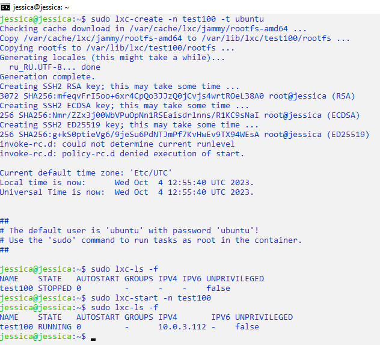
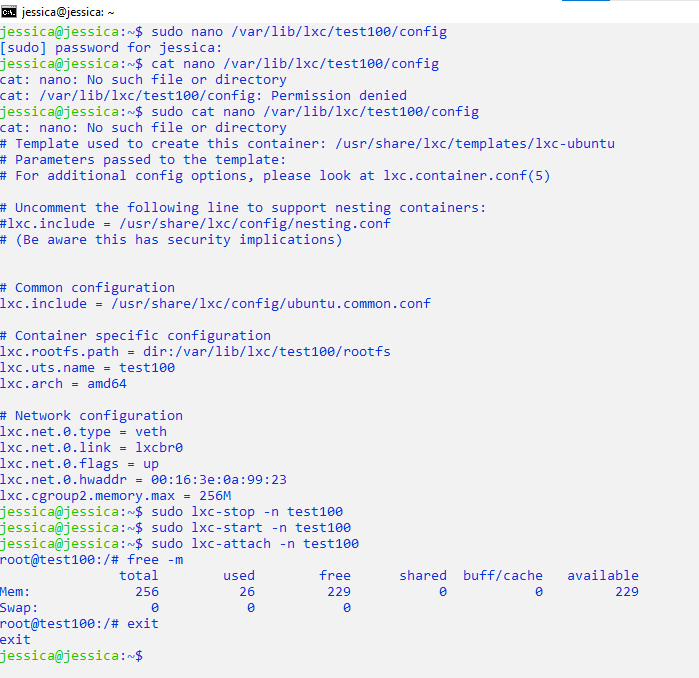
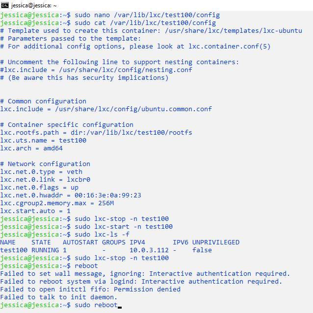
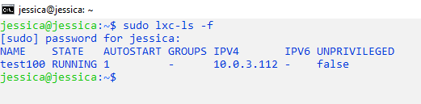
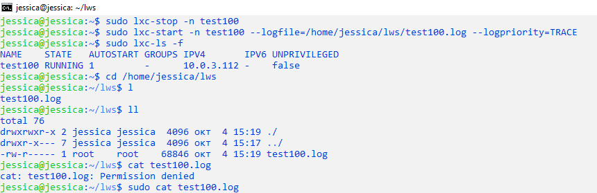
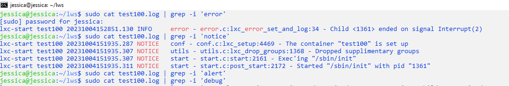

# Containerization. Workshop 2. Homework. Тогочакова Евгения. 4544
# Механизмы контрольных групп 
## Задание 1:
1) запустить контейнер с ubuntu, используя механизм LXC
```
jessica@jessica:~$ sudo lxc-create -n test100 -t ubuntu 
jessica@jessica:~$ sudo lxc-ls -f
jessica@jessica:~$ sudo lxc-start -n test100
jessica@jessica:~$ sudo lxc-ls -f 
```


2) ограничить контейнер 256 Мб ОЗУ и проверить, что ограничение работает

```
jessica@jessica:~$ sudo nano /var/lib/lxc/test100/config 
jessica@jessica:~$ sudo cat /var/lib/lxc/test100/config 
jessica@jessica:~$ sudo lxc-stop -n test100 
jessica@jessica:~$ sudo lxc-start -n test100
jessica@jessica:~$ sudo lxc-attach -n test100
root@test100:/# free -m 
exit 
jessica@jessica:~$         
```


3) добавить автозапуск контейнеру, перезагрузить ОС и убедиться, что контейнер действительно запустился самостоятельно
```
jessica@jessica:~$ sudo nano /var/lib/lxc/test100/config 
jessica@jessica:~$ sudo cat /var/lib/lxc/test100/config 
jessica@jessica:~$ sudo lxc-stop -n test100 
jessica@jessica:~$ sudo lxc-start -n test100
jessica@jessica:~$ sudo lxc-ls -f 
jessica@jessica:~$ sudo lxc-stop -n test100
jessica@jessica:~$ sudo reboot
```


И сразу же после нового подключения к виртуальной машине убеждаемся:
```
jessica@jessica:~$ sudo lxc-ls -f 
```


4) при создании указать файл, куда записывать логи
```
jessica@jessica:~$ sudo lxc-stop -n test100
jessica@jessica:~$ sudo lxc-start -n test100 --logfile=/home/jessica/lws/test100.log --logpriority=TRACE
jessica@jessica:~$ sudo lxc-ls -f 
jessica@jessica:~$ cd /home/jessica/lws 
jessica@jessica:~/lws$ ll
jessica@jessica:~/lws$ sudo cat test100.log

```


5) после перезагрузки проанализировать логи
```
jessica@jessica:~/lws$ sudo cat test100.log | grep -i 'error'
jessica@jessica:~/lws$ sudo cat test100.log | grep -i 'notice'
jessica@jessica:~/lws$ sudo cat test100.log | grep -i 'alert'
jessica@jessica:~/lws$ sudo cat test100.log | grep -i 'debug' 
```

